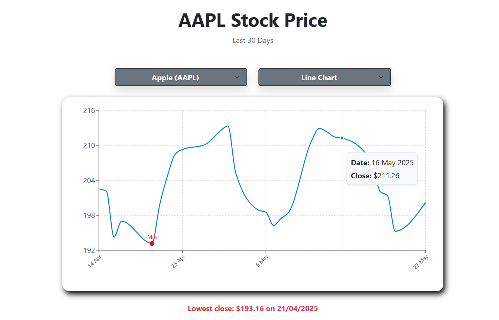
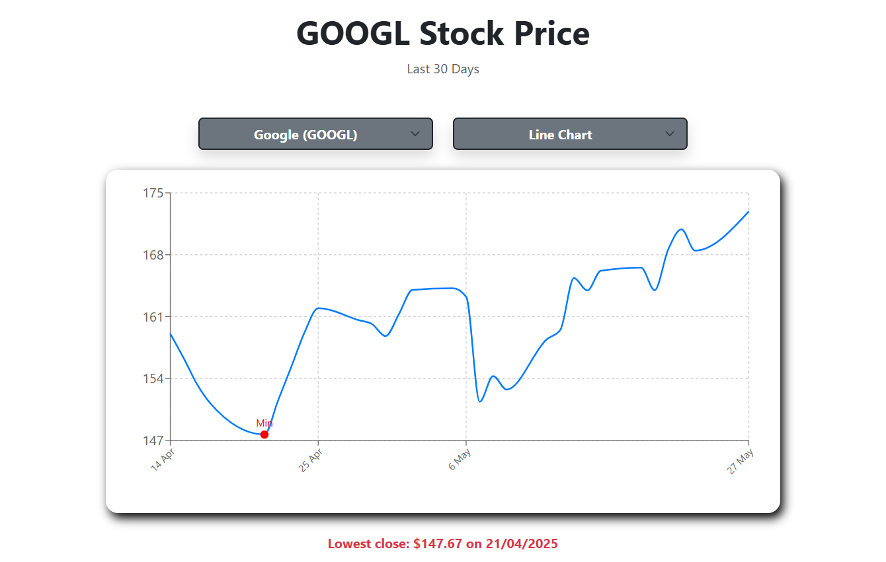
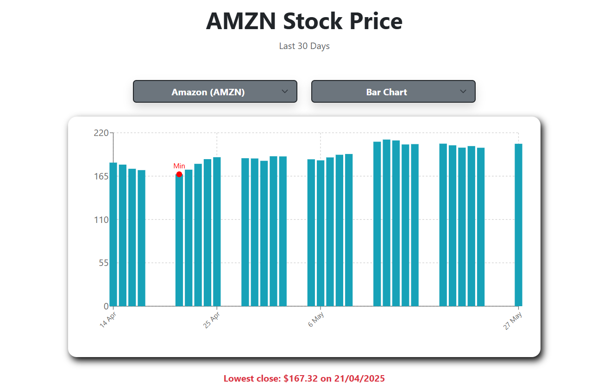
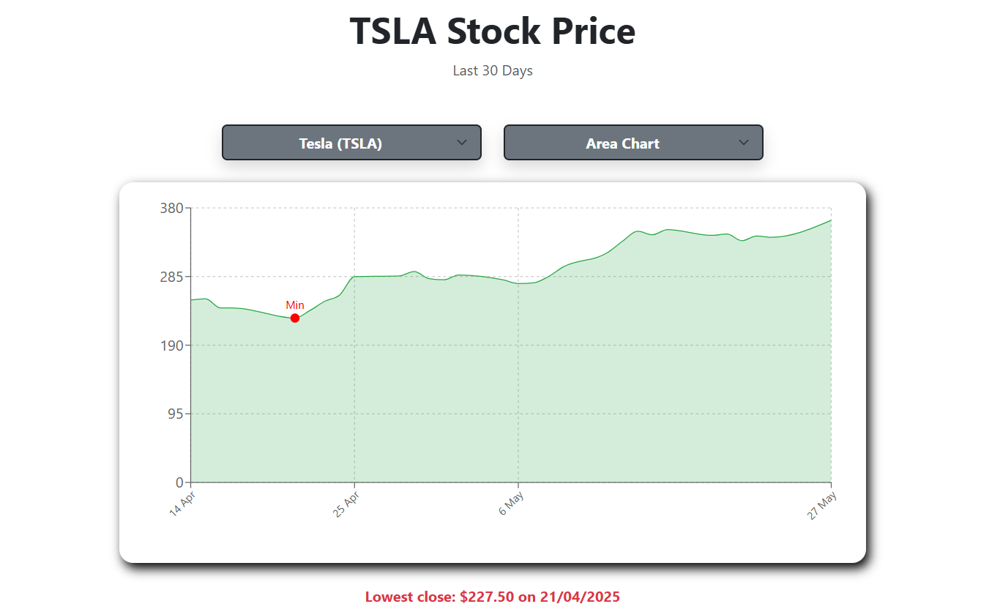
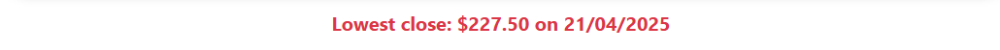

# Charts-App

## Description

This is a dsplay for charts using a [marketstack.com](https://marketstack.com/) API, with React.

## Instalation

The website page can be accessed here [Netlify](https://another-charts-app.netlify.app/).

## Usage

The main page displays the charts with the option to choose between stock companies and various charts. While the data is requested from the API, there will be a display of a loading spinner. The chart also displays a CustomTooltip component, a styled tooltip that appears when the cursor is hovered over a point on the chart. It displays the date and the close price. At the end of the page, there is a note of the lower close for the past 30 days.

## Credits

[Alexandra Ionescu](https://github.com/ionescuea)

## License

Licensed under the [MIT](LICENSE) license.
